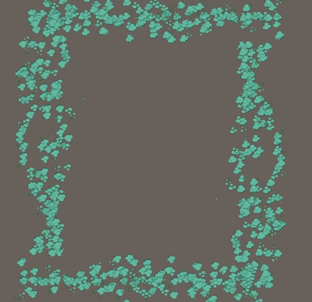

I realy like the game  Braw stars of SuperCell, this project i established is for fun ,the picture of poisoning fog  is implemented by approach of mesh particals,not that post processing effect you might thought it.  i plan to reverse this game models and textures as my own materials of multiple realtime fighting game, as a leisure hobby.

below is a poisoning fog i created for other project before, because of some special need, i didnt implement    tradditional way that use post processing with multiple sampling a cloud texture in a mod way. in  additional, this mesh particales approach have considered performance on mobile , i only calculated  half side of the fog square , another half of square is just discarded when square size is too big that cant fit into whole screen, and will auto adapted to character's position.

